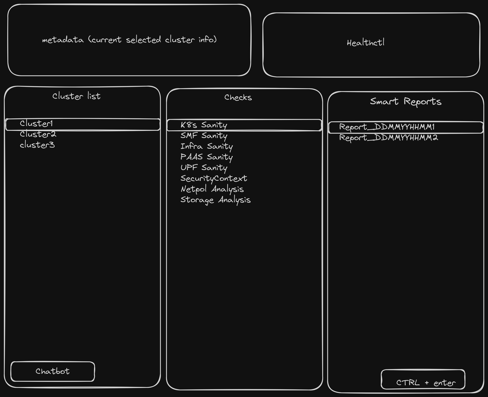

# healthctl
healthctl can club together checks for Kubernetes cluster along with the checks for Applications deployed and give a terminal friendly report along with an html report that can be used to share information and status.

It will help Cluster admin/testers do a quick sanity to determine if there is an issue with the cluster and reduce triage time. Going forward this will reduce the number of bugs reported if users can find and resolve the issue themselves.

The reports will have two views, one is a management friendly view that shows top level status of cluster, nodes, applications, storage-clusters like rook, Redis, mongo, elastic.

Second view will be for developers, that will include detailed reports on cluster resources, yaml outputs, information collected from monitor pods, events, reason of pod failure and optionally last few mins of logs.

This should reduce some back and forth of information sharing that developers request in a ticket and can be used as a standard procedure to collect the healthctl report as part of any bug.

## Installation
```bash
go get -u github.com/getkrabhijeet/healthctl
```

## Usage
```bash
healthctl
```

## Raw Design
