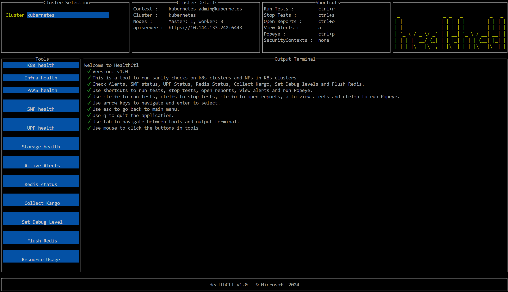

# healthctl : Kubernetes and Applcation Health Checker

[](https://goreportcard.com/report/github.com/getkrabhijeet/healthctl)
[](LICENSE)
[](RELEASE)

healthctl can club together checks for Kubernetes cluster along with the checks for Applications deployed and give a terminal friendly report along with an html report that can be used to share information and status.

It will help Cluster admin/testers do a quick sanity to determine if there is an issue with the cluster and reduce triage time. Going forward this will reduce the number of bugs reported if users can find and resolve the issue themselves.

The reports will have two views, one is a management friendly view that shows top level status of cluster, nodes, applications, storage-clusters like rook, Redis, mongo, elastic.

Second view will be for developers, that will include detailed reports on cluster resources, yaml outputs, information collected from monitor pods, events, reason of pod failure and optionally last few mins of logs.

This should reduce some back and forth of information sharing that developers request in a ticket and can be used as a standard procedure to collect the healthctl report as part of any bug.

## Building from source
* Clone the repository
```shell
git clone https://github.com/getkrabhijeet/healthctl.git
```
* cd into the directory
```shell
cd healthctl
```
* Run make to build the project
```shell
make
```
* Run the binary
```shell
./healthctl
```

## Makefile
```
make - builds the project and creates a binary "healthctl", copy it to any cluster to run tests on them

make clean - cleans up the executables from git repo

make install - copies "healthctl" to your /usr/local/bin

make uninstall - removes "healthctl" from your /usr/local/bin

make run - runs the main.go without building

You can run - "make install clean" to build, copy and clean up git repo at once
```

## Usage
```bash
healthctl
```

## Raw Design


## Developed Application


